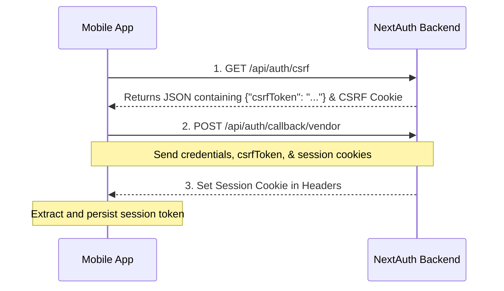

<!-- # Mobile App Authentication Integration Guide
## Integrating Vendor Sign-In (NextAuth Credentials Provider) with a Mobile Client

This guide explains how to authenticate a mobile client (such as a Flutter app) with the Next.js/NextAuth backend.

---

## The Authentication Workflow

Since NextAuth relies on secure, encrypted session cookies and CSRF protection, the authentication workflow for any external client requires two steps:



1. **Get CSRF Token**: Request the server's current CSRF token and store the response cookie.
2. **Execute Sign-In POST**: Send the email, password, CSRF token, and original cookies to the provider endpoint.
3. **Persist the Session Cookie**: Store the generated session cookie (`__Secure-next-auth.session-token` on Vercel/HTTPS, or `next-auth.session-token` on Localhost/HTTP) and attach it to subsequent API calls.

---

## 1. Automated Cookie Management (Recommended)

Using **Dio** and **Dio Cookie Manager** is the easiest way to handle this workflow, as it automatically tracks, persists, and includes session cookies with requests.

### Add Dependencies
Add these to your `pubspec.yaml`:
```yaml
dependencies:
  dio: ^5.4.0
  dio_cookie_manager: ^3.0.0
  cookie_jar: ^4.0.8
```

### Flutter Implementation
```dart
import 'package:dio/dio.dart';
import 'package:dio_cookie_manager/dio_cookie_manager.dart';
import 'package:cookie_jar/cookie_jar.dart';

class ApiService {
  final String baseUrl = 'https://vegking-backend.vercel.app'; // Or localhost
  late Dio dio;
  late CookieJar cookieJar;

  ApiService() {
    dio = Dio(BaseOptions(baseUrl: baseUrl));
    cookieJar = CookieJar();
    // Intercepts and automatically handles set-cookie / cookie headers
    dio.interceptors.add(CookieManager(cookieJar));
  }

  Future<bool> loginVendor(String email, String password) async {
    try {
      // Step 1: Fetch the CSRF Token
      final csrfResponse = await dio.get('/api/auth/csrf');
      final String? csrfToken = csrfResponse.data['csrfToken'];

      if (csrfToken == null) {
        throw Exception("Failed to retrieve CSRF token.");
      }

      // Step 2: POST credentials to callback
      final response = await dio.post(
        '/api/auth/callback/vendor',
        data: {
          'email': email,
          'password': password,
          'csrfToken': csrfToken,
          'json': true,
        },
        options: Options(
          contentType: Headers.jsonContentType,
          // Prevent Dio from throwing error on 302 redirects
          followRedirects: false,
          validateStatus: (status) => status! < 500,
        ),
      );

      // Verify if cookie was saved (we expect next-auth.session-token)
      var cookies = await cookieJar.loadForRequest(Uri.parse(baseUrl));
      bool hasSession = cookies.any((c) => c.name.contains('next-auth.session-token'));

      return hasSession;
    } catch (e) {
      print('Authentication Error: $e');
      return false;
    }
  }

  // Example of an authenticated request
  Future<Response?> getVendorProducts() async {
    try {
      // The session cookie is automatically attached by the CookieManager
      final response = await dio.get('/api/products');
      return response;
    } catch (e) {
      print('API Error: $e');
      return null;
    }
  }
}
```

---

## 2. Manual Cookie Implementation (Fallback)

If you are using the standard Dart `http` library, you must manually parse the `set-cookie` header from responses and inject it in subsequent requests.

```dart
import 'dart:convert';
import 'package:http/http.dart' as http;

class ManualApiService {
  final String baseUrl = 'https://vegking-backend.vercel.app';
  String? _sessionToken;

  // Helper to extract cookies from response headers
  void _updateCookies(http.Response response) {
    String? rawCookie = response.headers['set-cookie'];
    if (rawCookie != null) {
      // Look for the session token in the set-cookie headers
      // On live HTTPS, it is '__Secure-next-auth.session-token'
      // On localhost HTTP, it is 'next-auth.session-token'
      RegExp regExp = RegExp(r'(?:__Secure-)?next-auth\.session-token=([^;]+)');
      var match = regExp.firstMatch(rawCookie);
      if (match != null) {
        _sessionToken = match.group(1);
      }
    }
  }

  Future<bool> loginVendor(String email, String password) async {
    // Step 1: GET CSRF Token
    final csrfResponse = await http.get(Uri.parse('$baseUrl/api/auth/csrf'));
    final Map<String, dynamic> csrfData = jsonDecode(csrfResponse.body);
    final String csrfToken = csrfData['csrfToken'];
    
    // Save cookies from CSRF response (needed for csrf verification)
    String? csrfCookieHeader = csrfResponse.headers['set-cookie'];

    // Step 2: POST Sign In
    final loginResponse = await http.post(
      Uri.parse('$baseUrl/api/auth/callback/vendor'),
      headers: {
        'Content-Type': 'application/json',
        if (csrfCookieHeader != null) 'Cookie': csrfCookieHeader,
      },
      body: jsonEncode({
        'email': email,
        'password': password,
        'csrfToken': csrfToken,
        'json': true,
      }),
    );

    // Save session token from responses
    _updateCookies(loginResponse);

    return _sessionToken != null;
  }

  // Authed API Request
  Future<http.Response> getVendorData() async {
    if (_sessionToken == null) throw Exception("Unauthorized");

    return await http.get(
      Uri.parse('$baseUrl/api/products'),
      headers: {
        'Cookie': '__Secure-next-auth.session-token=$_sessionToken',
      },
    );
  }
}
```

---

## 3. Local vs. Live Environment Settings

Ensure the app resolves the correct session cookie name depending on the backend environment:

| Backend Host | Cookie Key Name |
| :--- | :--- |
| **Localhost (HTTP)** | `next-auth.session-token` |
| **Production (HTTPS)** | `__Secure-next-auth.session-token` | -->
