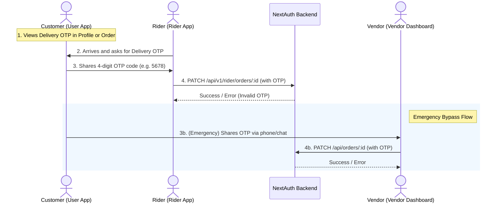

# Delivery OTP & Emergency Completion Integration Guide
## For Customer, Rider, and Vendor Client Applications

To secure deliveries and ensure orders are only completed when actually received, a **Delivery OTP** verification flow has been added. 

This guide details how to implement the client-side screens, prompts, and API integrations in the **User Flutter App**, the **Rider App**, and the **Vendor Dashboard**.

---

## High-Level Architecture Flow



---

## 1. User (Customer) Flutter App Side

The customer needs to see their **Delivery OTP** in their profile page or order tracking view.

### Step 1: Retrieve Profile Information
Make a request to the user profile API using the user's Authorization Bearer token:
* **Endpoint**: `GET /api/v1/user/profile`
* **Headers**: `Authorization: Bearer <USER_JWT_TOKEN>`

### Step 2: Show OTP in UI
The JSON response contains the `delivery_otp` field in the user profile payload:
```json
{
  "success": true,
  "data": {
    "_id": "660c1ab2cd98ef...",
    "name": "Rajesh Kumar",
    "mobile_no": "9999999999",
    "delivery_otp": "5834", // <-- Display this value!
    "wallet_balance": 150
  }
}
```

Display this code in the UI with text such as:
> **Delivery Verification PIN: `5834`**  
> *Provide this code to the delivery rider to confirm receipt of your order.*

---

## 2. Rider App Side

When the rider marks the order as delivered, the app must prompt them to enter the customer's OTP code.

### Step 1: Trigger Status Change UI
When the rider taps **"Complete Delivery"** (or changes status to "Delivered"), show an input dialog prompting for the OTP.

### Step 2: Call status update API
Submit the status update along with the OTP:
* **Endpoint**: `PATCH /api/v1/rider/orders/<order_id>`
* **Headers**: 
  - `Content-Type: application/json`
  - `Authorization: Bearer <RIDER_JWT_TOKEN>`
* **Body**:
  ```json
  {
    "orderStatus": "Delivered",
    "status": 4,
    "otp": "5834" // User-provided OTP
  }
  ```

### Step 3: Handle API Response
* **Success (200 OK)**: The order status has been updated to `Delivered`. Proceed to the success screen.
* **Error (400 Bad Request)**: 
  ```json
  {
    "error": "Invalid Delivery OTP."
  }
  ```
  Show a validation error message in the app: `"Incorrect OTP. Please check with the customer and try again."`

---

## 3. Vendor App (Emergency Bypass)

If the rider cannot complete the delivery (e.g. phone battery dead, internet issue, or emergency), the vendor has the authority to complete the order from their dashboard.

### Step 1: Open Change Status Dialog
In the vendor dashboard, clicking **"Change Status"** and selecting **"Delivered"** will display the "Customer Delivery OTP" input field.

### Step 2: Call status update API
* **Endpoint**: `PATCH /api/orders/<order_id>`
* **Headers**:
  - `Content-Type: application/json`
  - Cookie headers for NextAuth (`__Secure-next-auth.session-token`)
* **Body**:
  ```json
  {
    "orderStatus": "Delivered",
    "status": 4,
    "otp": "5834"
  }
  ```

*Note: If the OTP is invalid or empty, the server will return `400 Bad Request` with `{ "success": false, "error": "Invalid Delivery OTP." }`.*
